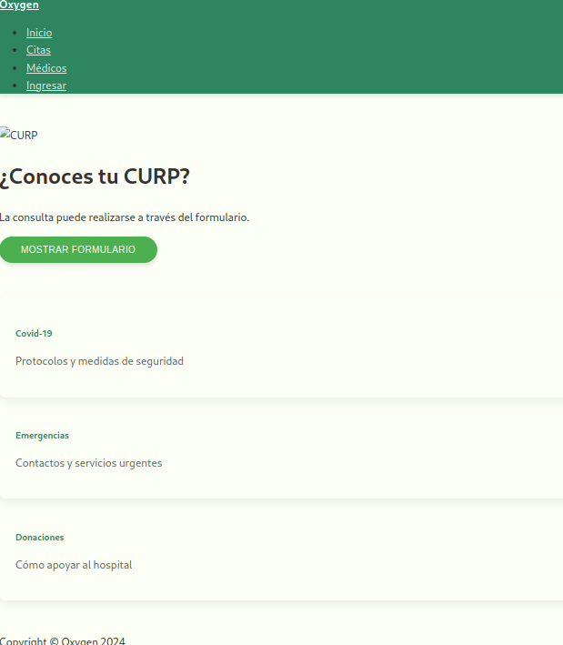
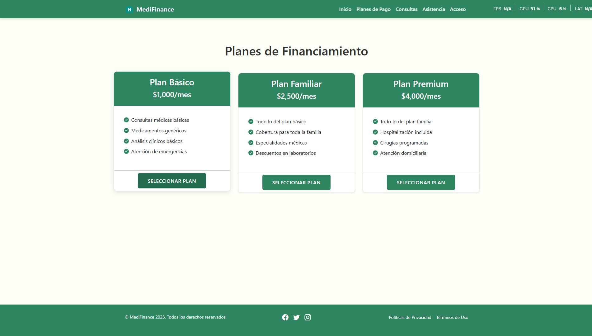
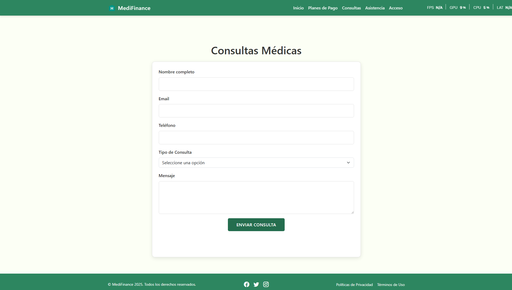
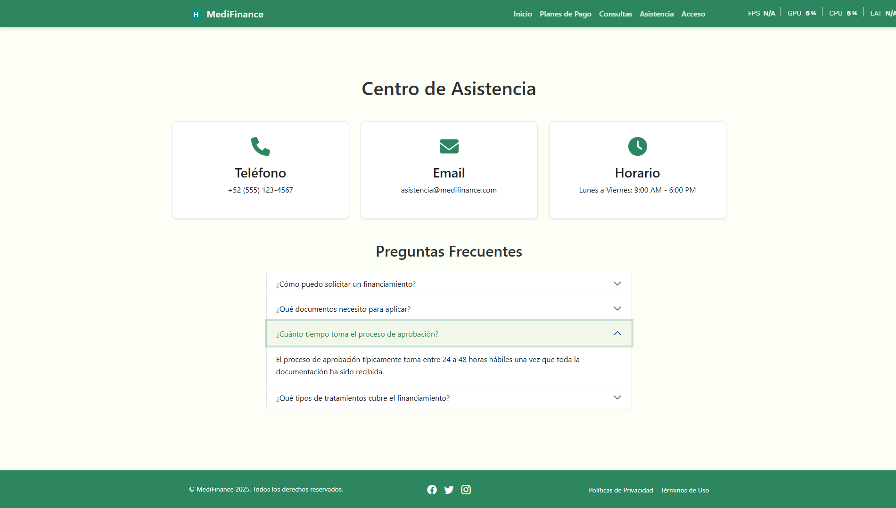
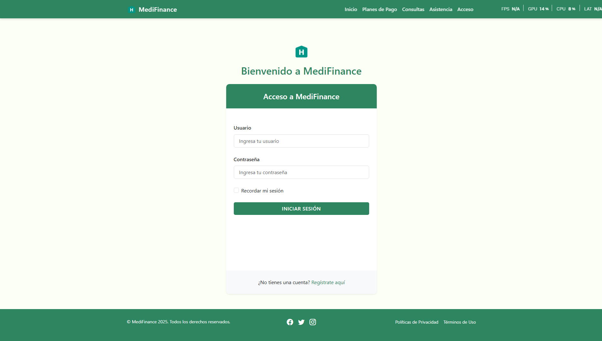

# MediFinance - Sistema de Financiamiento Hospitalario 🏥

## Imagenes








## Descripción
MediFinance es una aplicación web moderna desarrollada con React que facilita la gestión de financiamiento para servicios médicos y hospitalarios. Proporciona una interfaz intuitiva para que los usuarios puedan explorar planes de pago, solicitar consultas y acceder a asistencia financiera.

## Características Principales 🌟

- **Planes de Financiamiento**
  - Múltiples opciones de planes
  - Comparación de beneficios
  - Proceso de selección simplificado

- **Consultas Médicas**
  - Programación de citas
  - Seguimiento de consultas
  - Historial médico

- **Asistencia Financiera**
  - Centro de ayuda
  - Preguntas frecuentes
  - Contacto directo

- **Sistema de Autenticación**
  - Login seguro
  - Gestión de sesiones
  - Protección de rutas

## Tecnologías Utilizadas 💻

- React.js
- React Router DOM
- React Bootstrap
- Axios
- Font Awesome
- Bootstrap Icons

## Requisitos Previos 📋

- Node.js (versión 14 o superior)
- npm o yarn
- Servidor de base de datos (configurado separadamente)

## Instalación 🛠️

1. Clonar el repositorio:
```bash
git clone https://github.com/hectorflores28/reactjs-hospital.git
```

2. Instalar dependencias:
```bash
cd reactjs-hospital
npm install
```

3. Crear archivo .env con las variables de entorno necesarias:
```env
REACT_APP_API_URL=http://tu-api-url.com
```

4. Iniciar el servidor de desarrollo:
```bash
npm start
```

## Estructura del Proyecto 📁

```
reactjs-hospital/
├── public/
│   ├── index.html
│   └── assets/
├── src/
│   ├── components/
│   ├── pages/
│   ├── context/
│   ├── services/
│   ├── routes/
│   └── App.jsx
├── package.json
└── README.md
```

## Componentes Principales 🔍

### Navbar
- Navegación principal
- Enlaces a secciones importantes
- Responsive design

### Home
- Hero section
- Tarjetas informativas
- Formulario CURP

### Planes
- Visualización de planes
- Comparación de beneficios
- Selección de plan

### Consultas
- Formulario de consulta
- Calendario de citas
- Seguimiento

### Asistencia
- Centro de ayuda
- FAQ
- Información de contacto

## Estilos y Temas 🎨

El proyecto utiliza una paleta de colores consistente:
- Verde Principal: `#2d8660`
- Verde Secundario: `#4caf50`
- Verde Claro: `#8bc34a`
- Fondo Claro: `#f1f8e9`

## Scripts Disponibles 📜

- `npm start`: Inicia el servidor de desarrollo
- `npm build`: Construye la aplicación para producción
- `npm test`: Ejecuta las pruebas
- `npm eject`: Expone la configuración de webpack

## Contribución 🤝

1. Fork el proyecto
2. Crea tu rama de características (`git checkout -b feature/AmazingFeature`)
3. Commit tus cambios (`git commit -m 'Add some AmazingFeature'`)
4. Push a la rama (`git push origin feature/AmazingFeature`)
5. Abre un Pull Request

## Licencia 📄

Este proyecto está bajo la Licencia MIT - mira el archivo [LICENSE.md](LICENSE.md) para detalles

## Agradecimientos 🎁

- Equipo de desarrollo
- Contribuidores
- Usuarios beta

---
⌨️ con ❤️ por [Hector](https://github.com/hectorflores28) 